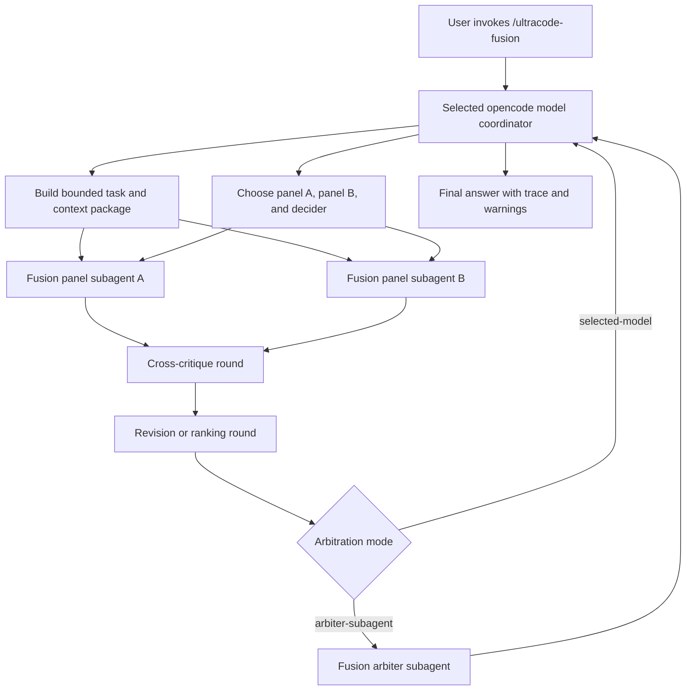

# Design Document

## Overview

Fusion workflows add explicit commands and fusion-specific opencode subagents that may run on configured models. The selected opencode model remains the coordinator: it gathers context, starts the fusion protocol, receives subagent outputs, and either arbitrates itself or delegates arbitration to an explicitly configured arbiter subagent. Each run can choose the two panel agents and the decider.

This is opencode-native multi-agent fusion. It is not a proxy and not a synthetic model. It uses normal opencode agent `model:` frontmatter for named fusion subagents, and the command protocol makes the fusion rounds explicit.

This is also not a design where two models are called once and GPT-5.5 performs an unstructured merge. That pattern is `panel-consult`. Strong fusion requires interaction: critique, revision, ranking, voting, or arbitration over prior-round outputs.

The planned default fusion concept is `critique-revise-vote`: two selected panel agents generate independent answers, cross-critique each other, revise, score or rank the revised answers, and then a selected decider produces the final answer. GPT-5/GPT-5-fusion-style pairings can be represented as a preset when matching fusion agents are configured.

## Boundary Commitments

- Fusion commands may use opencode subagents with explicit alternate `model:` frontmatter.
- Normal OpenUltraCode commands remain selected-model-first and do not silently route to alternate models.
- No opencode provider proxy.
- No synthetic model IDs.
- No hidden provider route installation.
- No automatic fusion on every prompt.
- No hidden model switch; every alternate model is visible through a named fusion subagent.

## Architecture



## Fusion-Specific Agents

Future implementation may add fusion-only agents such as:

- `.opencode/agents/ultracode-fusion-mimo.md`
- `.opencode/agents/ultracode-fusion-deepseek.md`
- `.opencode/agents/ultracode-fusion-critic.md`
- `.opencode/agents/ultracode-fusion-arbiter.md`

These agents may include `model:` frontmatter because their purpose is explicit multi-model fusion. They must be clearly named, documented, and validated as fusion-scoped exceptions. Existing non-fusion OpenUltraCode agents should continue to avoid hardcoded `model:` frontmatter unless a separate spec changes that boundary.

Fusion eligibility must be explicit and machine-checkable. The default rule should be an allowlist of fusion agent asset names, such as `.opencode/agents/ultracode-fusion-*.md`, plus any packaged metadata needed by the validator. Prompt wording alone is not enough to make an agent fusion-safe.

Example shape:

```md
---
description: Participates in OpenUltraCode fusion as the Mimo panel model.
mode: subagent
model: provider/mimo-2.5-pro
permission:
  edit: deny
  bash: deny
---

You are a bounded fusion panel participant. Use only the supplied context and return the requested round output.
```

The exact provider/model IDs should be user-configurable or documented as install-time placeholders. Checked-in examples must not include credentials.

## Subagent Dispatch Contract

Fusion commands rely on opencode's normal subagent mechanism. They do not create a provider route or switch the selected model. The selected model remains the coordinator and must request named fusion subagents by stable agent ID.

Dispatch inputs must include:

- the selected fusion strategy;
- the current round name;
- the subagent role for that round;
- the bounded context package;
- prior-round outputs required for that round;
- the expected output schema.

Dispatch outputs must include:

- the subagent ID;
- the role performed;
- the model identifier visible from the fusion agent asset or runtime metadata;
- status: `ok`, `error`, or `skipped`;
- structured round content;
- uncertainty, warnings, and cited context references.

If opencode cannot start the requested subagent, the command must produce a setup or degradation result according to the active strategy. It must not silently substitute another model or agent.

## Runtime Selection

Fusion commands should support either explicit selections or named presets.

Example invocation shapes:

```text
/ultracode-fusion --panel ultracode-fusion-gpt5 --panel ultracode-fusion-gpt5-alt --decider selected-model
/ultracode-fusion --preset gpt5-pair --decider ultracode-fusion-arbiter
/ultracode-fusion --preset mimo-deepseek --strategy critique-revise-vote
```

Selection rules:

- exactly two panel agents participate in the primary fusion run;
- panel agents must be declared fusion-specific agents;
- decider is either `selected-model` or one configured arbiter subagent;
- selected presets expand to two panel agents plus optional default strategy and arbiter;
- explicit command flags override preset defaults;
- invalid agent names, non-fusion agents, or missing models stop before any subagent is launched.

The spec should not hardcode GPT-5, Mimo, DeepSeek, or any other model as mandatory. It should make those pairings configurable. A GPT-5/GPT-5-fusion benchmark-inspired setup is a preset: two configured GPT-5-family panel agents, optionally with selected-model arbitration or a configured arbiter.

Same-family pairings, such as GPT-5/GPT-5-style presets, should avoid fake diversity. They should use distinct fusion agent roles or prompt profiles, and the final trace should disclose when both panel agents use the same model family. If no meaningful diversity is configured, the result is still valid but should be described as same-family fusion with a diversity caveat.

## File Structure Plan

Future implementation should add assets in small increments:

- `.opencode/commands/ultracode-fusion.md` or equivalent packaged command asset.
- Fusion-specific subagent files under `.opencode/agents/`.
- Optional `.opencode/commands/ultracode-fusion-consult.md` for weaker consultation fallback.
- Protocol helpers in `src/` only if needed to format trace/result state.
- Tests under `tests/` for command assets, fusion agent model exceptions, protocol trace shape, and no hidden provider routing.
- Documentation in `docs/` for setup, model assignment, data boundaries, fusion strategies, and failure modes.

This spec does not create those runtime files.

## Command Flow

### Strong Fusion Mode

1. User runs a fusion command with a question or task.
2. The selected opencode model reads relevant project context using normal tools and permissions.
3. The selected model resolves the two panel agents, decider, strategy, and any preset overrides.
4. The selected model packages task, constraints, relevant excerpts, assumptions, strategy, selected panels, and arbitration mode.
5. The selected model launches the configured fusion panel subagents with the same bounded context package.
6. Panel subagents produce independent initial answers.
7. The coordinator runs `critique-revise-vote` by default: cross-critique, revision, scoring/ranking, and arbitration.
8. Arbitration is performed by either the selected model or an explicit arbiter subagent.
9. The selected model returns the final answer with the strategy, participant models, warnings, and decision trace.

This mode is possible in opencode today because subagents can be configured with their own `model:` frontmatter and invoked from the selected model's workflow.

### Round Ownership

The default `critique-revise-vote` strategy uses these rounds:

| Round | Actor | Input | Required Output | Transition Rule |
| --- | --- | --- | --- | --- |
| Generate | Panel A and Panel B | Context package, task, constraints, strategy | Initial answer, assumptions, cited evidence, uncertainty | Continue when both panels return `ok`, or apply strategy failure policy. |
| Cross-critique | Panel A critiques Panel B; Panel B critiques Panel A | Context package plus the other panel's initial answer | Critique with correctness issues, missing evidence, risks, and suggested revisions | Continue when critiques are present; mark missing critique as degraded. |
| Revise | Each panel revises its own answer | Original answer plus peer critique | Revised answer, accepted/rejected critique points, remaining uncertainty | Continue when at least the required panel outputs exist for the strategy. |
| Vote/rank | Panels, configured voter subagent, or coordinator according to strategy config | Revised answers, critiques, context package, rubric | Scores or rankings with rationale | Continue to arbitration with all available votes and warnings. |
| Arbitrate | Selected model or configured arbiter subagent | Context package, revised answers, critiques, votes/rankings, rubric | Final answer, decision basis, unresolved disagreements, caveats | Final response must disclose decision source and degraded states. |

The implementation must choose one voting owner per strategy. If no separate voter is configured, voting is owned by the coordinator before arbitration. If an arbiter subagent is configured, the arbiter receives the vote/rank output and produces the final decision.

### Arbitration Rubric

The decider must score or compare candidate answers against a stable rubric:

- correctness against the supplied context;
- evidence support and citation quality;
- adherence to user constraints and boundary commitments;
- implementation feasibility in this codebase;
- risk of hidden model routing, proxy behavior, or unsafe permissions;
- handling of uncertainty and unresolved disagreements;
- simplicity and maintainability of the proposed answer.

The final answer does not need to expose every numeric score, but it must summarize why the winning answer or synthesis was chosen.

### Consultation Fallback

Consultation fallback may exist for low-cost or fast checks, but it must be labeled as consultation. It should not be the default behavior for `/ultracode-fusion` if the feature promises effective fusion.

Consultation means:

- independent model answers;
- no model interaction;
- no critique/revision/vote loop;
- selected model or simple arbiter merge.

If implemented, use a separate command or an explicit strategy such as `panel-consult`.

## Fusion Protocol Responsibilities

The fusion command/coordinator owns:

- selecting the fusion strategy;
- preparing the bounded context package;
- launching the configured subagents;
- passing prior-round outputs into critique, revision, ranking, voting, or arbitration prompts;
- collecting and summarizing trace data;
- disclosing participant models and degraded states.

Fusion subagents own:

- responding only within their assigned role;
- using only supplied context unless explicitly permitted otherwise;
- returning structured round output;
- surfacing uncertainty and conflicts.

The arbiter, when configured, owns:

- comparing revised outputs against the original task and context;
- choosing or synthesizing the final answer;
- explaining the decision basis;
- identifying unresolved disagreements.

## Context Package Schema

Subagents only see what the coordinator gives them. The coordinator should build a bounded package similar to:

```ts
type FusionContextPackage = {
  task: string
  constraints: string[]
  userVisibleGoal: string
  selectedPanels: [string, string]
  decider: "selected-model" | string
  strategy: FusionTrace["strategy"]
  excerpts: Array<{
    source: string
    lines?: string
    content: string
    reasonIncluded: string
  }>
  assumptions: string[]
  excluded: Array<{
    source: string
    reason: "secret" | "irrelevant" | "too-large" | "permission-denied"
  }>
  redactions: Array<{
    source: string
    kind: "credential" | "token" | "private-key" | "personal-data" | "other"
  }>
  budget: {
    maxExcerpts: number
    maxCharsPerExcerpt: number
    maxRounds: number
  }
}
```

The coordinator must not include credentials, private keys, environment files, provider tokens, unrelated files, or full repository dumps. Prior-round outputs are attached separately to the round prompt, not mixed into the original context package, so the trace can distinguish source context from model-generated content.

## Protocol Shape

The command should maintain a trace similar to:

```ts
type FusionTrace = {
  strategy: "critique-revise-vote" | "debate-rank" | "critique-revise" | "vote-decide" | "panel-consult"
  preset?: string
  panels: [string, string]
  arbitration: "selected-model" | "arbiter-subagent"
  arbiter?: string
  participants: Array<{
    id: string
    role: "generator" | "critic" | "reviser" | "voter" | "arbiter"
    model?: string
    status: "ok" | "error" | "skipped"
    summary?: string
    error?: string
  }>
  rounds: Array<{
    name: string
    inputs: string[]
    outputs: string[]
    summary: string
  }>
  finalDecisionSource: "selected-model" | "arbiter-subagent"
  warnings: string[]
}
```

The final response should include enough of this trace for the user to see whether they got real fusion or consultation.

## Configuration Shape

Fusion model assignment should be explicit. It may be supplied through checked-in fusion agent assets, user overrides, or install-time templates. Example opencode agent frontmatter can carry model IDs, while credentials remain in normal provider configuration or environment variables.

Example conceptual mapping:

```json
{
  "fusion": {
    "defaultStrategy": "critique-revise-vote",
    "agents": [
      "ultracode-fusion-gpt5",
      "ultracode-fusion-gpt5-alt",
      "ultracode-fusion-mimo",
      "ultracode-fusion-deepseek",
      "ultracode-fusion-arbiter"
    ],
    "presets": {
      "gpt5-pair": {
        "panels": ["ultracode-fusion-gpt5", "ultracode-fusion-gpt5-alt"],
        "decider": "selected-model",
        "strategy": "critique-revise-vote"
      },
      "mimo-deepseek": {
        "panels": ["ultracode-fusion-mimo", "ultracode-fusion-deepseek"],
        "decider": "ultracode-fusion-arbiter",
        "strategy": "critique-revise-vote"
      }
    },
    "allowConsultationFallback": false
  }
}
```

Exact configuration location should be finalized during implementation to fit the existing plugin option parser and opencode asset conventions.

## Failure Modes

- Missing fusion subagent: return a setup error and do not claim fusion ran.
- Invalid panel count: reject unless exactly two panel agents are selected.
- Invalid decider: reject unless the decider is `selected-model` or an approved arbiter subagent.
- Subagent model unavailable: return degraded status and disclose which participant failed.
- One panel fails: continue only if the strategy permits partial fusion; otherwise stop.
- Arbiter unavailable: fall back to selected-model arbitration only if configured; otherwise stop.
- Unsupported strategy: reject before launching subagents.
- Context too large: ask selected model to reduce the context package.
- Only independent panel outputs were collected: label the result `panel-consult`, not fusion.

Per-strategy degradation policy:

- `critique-revise-vote`: requires two successful initial panel answers for strong fusion; if a later critique, revision, or vote fails, return degraded fusion only when the missing round is disclosed and arbitration still has enough evidence.
- `debate-rank`: requires both panels through the debate step; missing debate output stops the strategy.
- `critique-revise`: requires both panels through revision; missing revision output becomes degraded fusion or hard failure according to command config.
- `vote-decide`: requires at least two candidate answers and a valid vote/rank owner.
- `panel-consult`: may return independent answers only, but must not be labeled strong fusion.

## Testing Strategy

- Asset validation confirms `model:` frontmatter is allowed only for approved fusion-specific agents.
- Asset validation still rejects hidden provider routes, synthetic model IDs, and unexpected model frontmatter in non-fusion assets.
- Unit tests cover runtime panel/decider selection, presets, and invalid selections.
- Unit tests cover strategy trace generation for `critique-revise-vote`, `debate-rank`, and `panel-consult`.
- Unit tests verify consultation cannot be reported as strong fusion.
- Failure tests cover missing subagent, unavailable model, partial panel failure, arbiter failure, unsupported strategy, and oversized context.
- Tests verify the subagent dispatch contract, round ownership table, arbitration rubric fields, context redaction behavior, and same-family model disclosure.

## Risks

- Users may confuse explicit model-specific subagents with hidden routing. Mitigation: names, docs, and final traces disclose every participant model.
- Fusion can become too slow or expensive. Mitigation: explicit command invocation, bounded rounds, and optional consultation fallback.
- Subagents may drift beyond supplied context. Mitigation: role prompts require bounded-context use and trace uncertainty.
- Existing validation rejects all agent `model:` frontmatter. Mitigation: update validation to permit only fusion-scoped exceptions.
