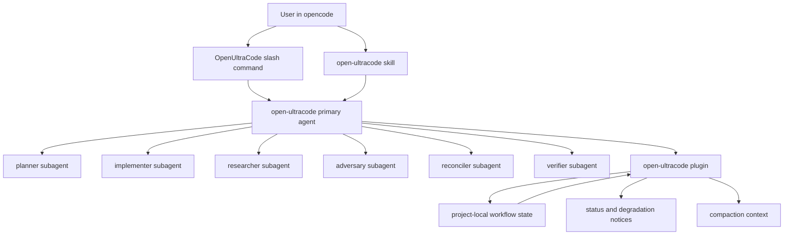
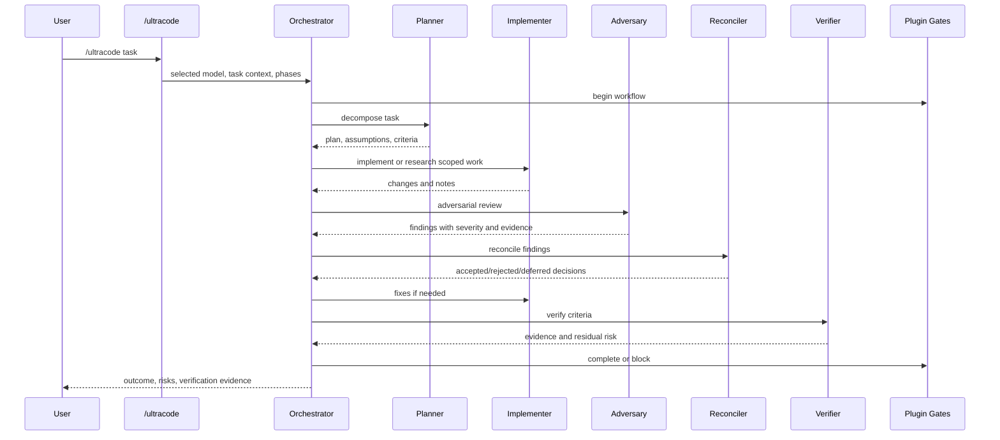
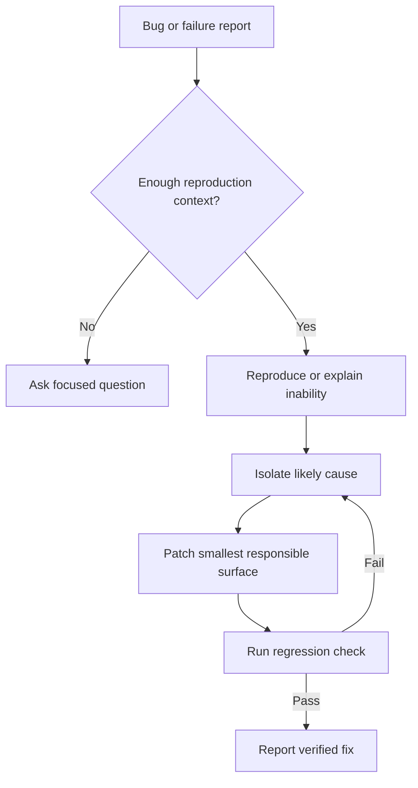
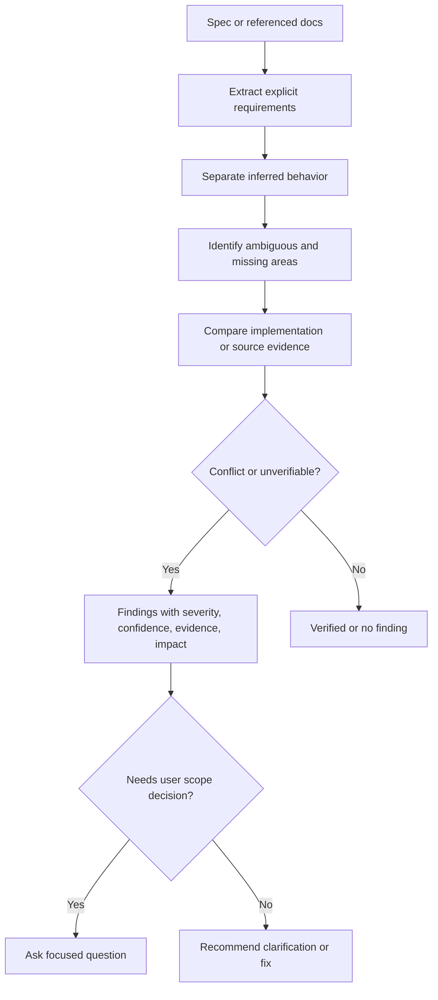

# Design Document

## Overview

OpenUltraCode is an opencode-native workflow package that adds UltraCode-style task discipline without a proxy, model alias, gateway URL, or provider router. It is delivered as a project-local opencode package: a layered skill, command templates, role agents, a thin TypeScript plugin, documentation, and tests.

The selected opencode model remains authoritative. OpenUltraCode uses opencode's native agent, command, skill, permission, and plugin systems to guide comprehensive workflows through decomposition, role-specialized execution, adversarial review, reconciliation, and verification.

## Boundary Commitments

### Owned By This Spec

- Project-local OpenUltraCode opencode package layout.
- Layered workflow skill and prompt guidance.
- Role agents for planner, implementer, adversary, verifier, reconciler, and researcher.
- Slash commands for comprehensive execution, debugging, spec audit, adversarial research, and verification.
- Plugin runtime guardrails for phase state, status notices, verification-state tracking, degradation reporting, optional high-effort request mutation, and compaction persistence.
- Documentation explaining native workflow behavior, limits, installation, configuration, and examples.
- Tests that validate config shape, prompt assets, selected-model preservation, state transitions, and plugin behavior.

### Not Owned By This Spec

- UltraCode-Shim proxy behavior.
- Anthropic-to-OpenAI or OpenAI-to-Anthropic API translation.
- Synthetic model IDs, worker model aliases, provider routing, or gateway discovery.
- Replacing or automatically changing the selected opencode model.
- Recreating private Claude Code dynamic-workflow internals.
- Guaranteeing hidden reasoning or chain-of-thought access.
- Bypassing opencode permissions, provider limits, or user confirmation flows.

### Allowed Dependencies

- opencode project config and filesystem conventions.
- `@opencode-ai/plugin` types and helpers.
- TypeScript for plugin source.
- Node/Bun runtime as required by opencode local plugins.
- Python standard library or Node standard library for local validation scripts.

### Revalidation Triggers

- opencode changes plugin hook names, command markdown format, agent inheritance behavior, or permission semantics.
- OpenUltraCode adds default model overrides.
- Workflow state persistence moves outside `.opencode/open-ultracode/`.
- External services are introduced beyond the user's selected opencode model/provider.
- A workflow mode is added or removed.

## Architecture



The architecture uses three layers.

1. Prompt layer: skill and command templates define workflow behavior in visible Markdown.
2. Role layer: agents provide focused prompts and permissions while inheriting the selected model.
3. Runtime layer: plugin tracks state, reports degradation, injects optional high-effort parameters, and exposes status/verification tools.

## File Structure Plan

| Path | Responsibility |
| --- | --- |
| `opencode.json` | Optional project entrypoint with schema, plugin registration if needed, skill paths if packaged outside default locations, and command/agent examples. Must not set a default model. |
| `.opencode/skills/open-ultracode/SKILL.md` | Layered workflow brain: routing rules, phase discipline, role contract, adversarial research, spec-audit behavior, verification gates, and fallback paths. |
| `.opencode/commands/ultracode.md` | Comprehensive task execution command using the selected model and OpenUltraCode phase sequence. |
| `.opencode/commands/ultracode-debug.md` | Debug command: reproduce, isolate, patch, regression test, verify. |
| `.opencode/commands/ultracode-spec-audit.md` | Spec audit command: extract claims, compare evidence, classify gaps, ask focused questions. |
| `.opencode/commands/ultracode-research.md` | Adversarial research command: investigate incomplete specs and assumptions. |
| `.opencode/commands/ultracode-verify.md` | Verification command: collect evidence, map checks to criteria, report status. |
| `.opencode/agents/open-ultracode.md` | Primary orchestrator agent. Coordinates roles, preserves selected model by omitting `model`, and controls task permissions. |
| `.opencode/agents/open-ultracode-planner.md` | Planning subagent. Read-only decomposition, assumptions, constraints, and completion criteria. |
| `.opencode/agents/open-ultracode-implementer.md` | Implementation subagent. Edits allowed according to normal project permissions. |
| `.opencode/agents/open-ultracode-adversary.md` | Adversarial review subagent. Read-only, evidence-first critique with severity and confidence. |
| `.opencode/agents/open-ultracode-reconciler.md` | Reconciliation subagent. Classifies adversarial findings as accepted, rejected, clarification-needed, or deferred. |
| `.opencode/agents/open-ultracode-verifier.md` | Verification subagent. Runs or reasons about checks and maps evidence to criteria. |
| `.opencode/agents/open-ultracode-researcher.md` | Research subagent. Handles spec evidence, external docs when permitted, and source comparison. |
| `.opencode/plugins/open-ultracode.ts` | opencode plugin entrypoint and hook registration. |
| `src/config.ts` | Typed OpenUltraCode options parser and defaults. |
| `src/types.ts` | Shared enums and interfaces for modes, phases, findings, verdicts, evidence, state, and notices. |
| `src/state.ts` | Project-local state read/write with minimal persisted content. |
| `src/hooks.ts` | Hook implementations for events, compaction, shell env, tool execution, and optional request mutation. |
| `src/status-tool.ts` | Custom plugin tool for workflow status and degradation notices. |
| `src/verification-tool.ts` | Custom plugin tool for recording verification evidence and completion gates. |
| `src/high-effort.ts` | Provider-capability-aware request option mapping and degradation reporting. |
| `src/degradation.ts` | Standardized degradation messages and unsupported-capability records. |
| `src/index.ts` | Re-exported plugin entrypoint for package builds. |
| `docs/README.md` | User-facing installation, concepts, commands, and examples. |
| `docs/CONCEPTS.md` | Shim vs harness vs skill vs agent vs command vs plugin. |
| `docs/LIMITS.md` | Native behavior vs UltraCode-Shim proxy behavior and provider limitations. |
| `docs/CONFIGURATION.md` | Strict/advisory/disabled gates, high-effort settings, state storage, and safety knobs. |
| `tests/config.test.ts` | Config parsing and invalid setting tests. |
| `tests/assets.test.ts` | Static tests ensuring command and agent files omit default model overrides and contain required frontmatter. |
| `tests/state.test.ts` | Workflow state transition and persistence tests. |
| `tests/plugin.test.ts` | Hook behavior, degradation notices, compaction context, and verification gate tests. |
| `tests/high-effort.test.ts` | Best-effort provider option mapping and unsupported behavior tests. |
| `scripts/validate-assets.ts` | Local validation script for Markdown frontmatter, command names, required role files, and selected-model preservation. |

## System Flows

### Comprehensive Task Execution



### Debug Workflow



### Spec Audit And Adversarial Research



## Components And Interfaces

### Layered Workflow Skill

The skill is the primary workflow brain. It contains visible instructions and is triggered by phrases such as `ultracode`, `comprehensive workflow`, `adversarial research`, `spec audit`, `debug loop`, and `multi-agent review`.

Responsibilities:
- Select the workflow pattern based on task type.
- Require goal, context, constraints, and completion criteria before substantial work.
- Define phase sequence and fallback behavior.
- Define role handoff contracts.
- Require verification evidence before completion claims.

Non-responsibilities:
- It does not mutate opencode request parameters.
- It does not store state.
- It does not override selected model.

### Command Templates

Command templates start workflows predictably.

Command contract:
```ts
interface CommandContract {
  name: string
  mode: WorkflowMode
  agent: "open-ultracode"
  subtask?: boolean
  template: string
  mustOmitModel: true
}
```

Each command template must:
- Show selected workflow mode and expected phases.
- Pass `$ARGUMENTS` as task input.
- Ask for missing task context if the prompt is insufficient.
- Avoid `model` frontmatter by default.

### Role Agents

Agents use Markdown frontmatter and visible prompts.

Role contract:
```ts
type RoleName =
  | "planner"
  | "implementer"
  | "adversary"
  | "reconciler"
  | "verifier"
  | "researcher"

interface RoleContract {
  role: RoleName
  mode: "primary" | "subagent" | "all"
  description: string
  model?: never
  permissions: RolePermissions
  outputSchema: string
}
```

Default agents must omit `model`. Users may intentionally add model overrides later, but that is outside default package behavior.

### Plugin Runtime

The plugin is a thin enforcement and observability layer.

Responsibilities:
- Parse typed OpenUltraCode options.
- Track active workflow mode and phase.
- Record verification evidence and residual risk.
- Emit visible degradation notices for unsupported behavior.
- Inject compaction context for active workflow state.
- Optionally request high-effort provider options when configured and supported.
- Provide custom tools for status and verification evidence.

Non-responsibilities:
- It does not run a proxy.
- It does not route models.
- It does not hide or replace workflow prompts.
- It does not bypass permissions.

Plugin interface:
```ts
import type { Plugin } from "@opencode-ai/plugin"

export const OpenUltraCodePlugin: Plugin = async (input, options?: OpenUltraCodeOptionsInput) => {
  const config = parseOpenUltraCodeOptions(options)
  const state = createWorkflowStateStore(input.directory, config)

  return createOpenUltraCodeHooks(input, config, state)
}
```

### State Store

The state store persists minimal project-local state.

Storage path:
` .opencode/open-ultracode/state/workflow-state.json `

State rules:
- Store summaries and evidence references, not hidden chain-of-thought.
- Store only in project-local `.opencode/open-ultracode/` by default.
- Make transcript persistence opt-in and out of scope for initial implementation.
- Recover gracefully from missing or corrupt state by starting a new state and reporting degradation.

### High-Effort Adapter

The adapter maps user preferences into provider options only when a safe and documented path exists.

Behavior:
- If disabled, do nothing.
- If provider support is known, request configured reasoning/output controls.
- If support is unknown or rejected, record a degradation notice and continue.
- Never claim hidden reasoning access.

## Data Models

```ts
export type WorkflowMode = "build" | "debug" | "spec-audit" | "adversarial-research" | "verify"

export type WorkflowPhase =
  | "idle"
  | "intake"
  | "planning"
  | "execution"
  | "research"
  | "adversarial-review"
  | "reconciliation"
  | "verification"
  | "remediation"
  | "completed"
  | "blocked"

export type GatePolicy = "strict" | "advisory" | "disabled"

export type AdversarialPolicy = "required" | "recommended" | "disabled"

export type FindingSeverity = "high" | "medium" | "low"

export type FindingConfidence = "high" | "medium" | "low"

export type FindingDisposition = "accepted" | "rejected" | "clarification-needed" | "deferred"

export type CompletionStatus = "verified" | "partial" | "blocked" | "research-only"

export interface OpenUltraCodeOptions {
  enabled: boolean
  adversarialReview: AdversarialPolicy
  verificationGate: GatePolicy
  highEffort: {
    enabled: boolean
    effort: "medium" | "high" | "xhigh"
    outputTokens?: number
  }
  state: {
    directory: string
    persistTranscripts: false
  }
  notices: {
    showDegradation: boolean
  }
}

export interface WorkflowState {
  sessionId?: string
  mode: WorkflowMode
  phase: WorkflowPhase
  startedAt: string
  updatedAt: string
  goal?: string
  constraints: string[]
  assumptions: string[]
  criteria: AcceptanceCriterion[]
  findings: Finding[]
  verification: VerificationEvidence[]
  degradations: DegradationNotice[]
  completion?: CompletionReport
}

export interface AcceptanceCriterion {
  id: string
  text: string
  source: "user" | "spec" | "inferred"
  status: "pending" | "verified" | "unverified" | "not-applicable"
}

export interface Finding {
  id: string
  severity: FindingSeverity
  confidence: FindingConfidence
  evidence: string
  impact: string
  recommendation: string
  disposition?: FindingDisposition
  dispositionReason?: string
}

export interface VerificationEvidence {
  id: string
  command?: string
  artifact?: string
  result: "pass" | "fail" | "not-run"
  reason?: string
  criteriaIds: string[]
  residualRisk?: string
}

export interface DegradationNotice {
  capability: string
  reason: string
  userVisibleMessage: string
  occurredAt: string
}

export interface CompletionReport {
  status: CompletionStatus
  summary: string
  unresolvedRisks: string[]
  verificationIds: string[]
}
```

## Error Handling

| Failure | Handling |
| --- | --- |
| OpenUltraCode disabled | Plugin returns inert hooks; commands and docs still exist but state/status tools report disabled. |
| Invalid plugin options | Parser reports exact invalid setting and valid values; defaults are applied only when safe. |
| Missing opencode hook capability | Plugin records a degradation notice naming the unavailable behavior. |
| Role execution unavailable | Skill and command templates instruct single-session fallback with the same phase sequence. |
| Adversarial review required but skipped | Verification gate blocks completion or reports partial/blocked status according to policy. |
| Verification required but absent | Strict mode blocks verified completion; advisory mode reports residual risk; disabled mode records no gate. |
| State file corrupt | Preserve corrupt file as `.bak` when possible, start a new state, and report degradation. |
| Provider rejects high-effort settings | Continue without high-effort and record user-visible degradation. |
| Permission denies a needed action | Respect opencode permission flow and report the blocked action and safe next step. |

## Testing Strategy

### Unit Tests

- `tests/config.test.ts`: verifies valid options, invalid enum values, disabled mode, strict/advisory/disabled gates, and default state directory.
- `tests/state.test.ts`: verifies state creation, phase transitions, corrupt-state recovery, minimal persistence, and completion status transitions.
- `tests/high-effort.test.ts`: verifies high-effort disabled path, supported option mapping, unsupported-provider degradation, and no hidden-reasoning claim.
- `tests/degradation.test.ts`: verifies standardized messages include capability, reason, and user-visible text.

### Static Asset Tests

- `tests/assets.test.ts`: verifies all required skill, command, agent, and doc files exist.
- Verifies default command and agent frontmatter do not contain `model:`.
- Verifies required command names exist: `ultracode`, `ultracode-debug`, `ultracode-spec-audit`, `ultracode-research`, `ultracode-verify`.
- Verifies read-only roles deny edits by default.
- Verifies command templates include expected phase descriptions and missing-context prompts.

### Plugin Hook Tests

- `tests/plugin.test.ts`: uses mocked opencode hook input/output shapes at system boundaries only.
- Verifies hooks are inert when disabled.
- Verifies compaction context includes active mode, phase, assumptions, findings summary, and verification status.
- Verifies tool status output distinguishes verified, partial, blocked, and research-only completion.
- Verifies verification evidence is required before strict completion.

### Workflow Prompt Tests

- Build workflow fixture: confirms plan, implement, adversarial review, reconciliation, and verification instructions are present.
- Debug workflow fixture: confirms reproduce, isolate, patch, regression test, and verify instructions are present.
- Spec-audit fixture: confirms explicit requirements, inferred behavior, ambiguity, missing information, and assumptions are separated.
- Adversarial research fixture: confirms findings include severity, confidence, evidence, impact, and recommendation.

### Manual Acceptance Checks

- Install into a sample opencode project and confirm `/ultracode` commands appear.
- Select a model in opencode, run `/ultracode`, and verify no command or agent overrides the model.
- Run a workflow where subagents are unavailable and confirm single-session fallback.
- Run with high-effort disabled and confirm no high-effort options are requested.
- Run with strict verification and confirm final output cannot claim verified completion without evidence.

## Security And Privacy

- OpenUltraCode respects opencode permissions for reads, edits, command execution, web access, task delegation, and external directories.
- Role agents use least privilege by default. Adversary, verifier, planner, and researcher are read-oriented and deny edits unless the user changes their config.
- The plugin stores minimal project-local state and does not store provider credentials.
- No secrets or provider keys are required beyond the user's existing opencode provider configuration.
- Sensitive findings remain in the local session and project files unless the user explicitly shares or publishes them.
- The package must document that transcript persistence is not enabled by default.

## Performance

- Plugin hooks must be O(1) or proportional to the small workflow state file.
- State writes should happen only on phase changes, verification records, degradation notices, and completion updates.
- Commands and skill prompts should avoid embedding large static content repeatedly; detailed reference should live in the skill and docs.
- Subagent fanout is user-visible and controlled by workflow policy; single-session fallback avoids hard dependency on parallel execution.

## Requirements Traceability

| Requirement ID | Design Coverage |
| --- | --- |
| 1.1 | Commands and role agents omit `model`; role agents inherit the selected model. |
| 1.2 | Boundary excludes proxy, gateway URL, synthetic IDs, and aliases. |
| 1.3 | Degradation notices report unsupported provider or hook behavior. |
| 1.4 | Plugin and assets do not route or switch providers. |
| 1.5 | Selected-model inheritance applies after user changes opencode model. |
| 2.1 | Layered skill adds decomposition, tool-use, assumptions, adversarial review, and verification guidance. |
| 2.2 | Commands require goal, context, constraints, and completion criteria. |
| 2.3 | Workflow state model preserves phase awareness. |
| 2.4 | Verification gate blocks or reports missing evidence by policy. |
| 2.5 | Workflow modes distinguish direct build, debug, research, spec-audit, and verify tasks. |
| 3.1 | Skill covers build, debug, spec-audit, adversarial-research, and general long-task workflows. |
| 3.2 | Comprehensive workflow flow includes plan, implement, adversarial review, fix/reconcile, and verify. |
| 3.3 | Debug flow includes reproduce, isolate, patch, regression test, and verify. |
| 3.4 | Spec-audit flow extracts claims, missing requirements, evidence, and gaps. |
| 3.5 | Skill includes simple-task shortcut while preserving proportional verification. |
| 4.1 | Comprehensive flow decomposes into planning, execution, adversarial review, reconciliation, and verification. |
| 4.2 | Role agent files define planner, implementer, adversary, verifier, reconciler, and researcher. |
| 4.3 | Role contracts pass only scoped task context and prior phase outputs. |
| 4.4 | Reconciliation is required for high- and medium-severity adversarial findings. |
| 4.5 | Reconciler disposition requires evidence-based rejection reasons. |
| 4.6 | Completion report includes outcome, risks, verification evidence, and assumptions. |
| 5.1 | Spec-audit mode separates explicit, inferred, ambiguous, missing, and assumed items. |
| 5.2 | Incomplete specs are treated as normal inputs in the spec-audit flow. |
| 5.3 | Conflict reporting includes source of each mismatch. |
| 5.4 | Unverifiable criteria use `unverified` status. |
| 5.5 | Finding model includes severity, confidence, evidence, impact, and recommendation. |
| 5.6 | Command templates and skill ask focused questions for scope ambiguity. |
| 6.1 | `.opencode/commands/ultracode.md` provides comprehensive execution. |
| 6.2 | `.opencode/commands/ultracode-debug.md` provides debugging. |
| 6.3 | `.opencode/commands/ultracode-spec-audit.md` provides spec audit. |
| 6.4 | `.opencode/commands/ultracode-research.md` provides adversarial research. |
| 6.5 | Command templates show selected mode and expected phases. |
| 6.6 | Command templates ask for missing user-observable task information. |
| 7.1 | High-effort adapter requests controls only when supported and configured. |
| 7.2 | High-effort adapter maps output budget preferences where supported. |
| 7.3 | Unsupported high-effort controls produce degradation notices and continue. |
| 7.4 | Data model and docs explicitly avoid hidden chain-of-thought claims. |
| 7.5 | Disabled high-effort path leaves workflow guidance active without request mutation. |
| 8.1 | Verification gate requires evidence before completion for file-changing workflows. |
| 8.2 | Failed verification keeps workflow in remediation or blocked state. |
| 8.3 | `not-run` evidence requires reason and residual risk. |
| 8.4 | Completion status distinguishes verified, partial, blocked, and research-only. |
| 8.5 | Verification evidence maps to criterion IDs. |
| 9.1 | Options include `enabled`. |
| 9.2 | Options include `adversarialReview`. |
| 9.3 | Options include `verificationGate`. |
| 9.4 | Options include high-effort effort and output-token preferences. |
| 9.5 | Config parser reports specific invalid settings and valid values. |
| 9.6 | Disabled mode returns inert plugin hooks and normal opencode behavior. |
| 10.1 | Degradation model reports unavailable hooks and capabilities. |
| 10.2 | Skill and commands define single-session fallback. |
| 10.3 | Error handling reports failed phase, reason, and safe next action. |
| 10.4 | Required adversarial review cannot be silently skipped under policy. |
| 10.5 | Required verification cannot be silently skipped under policy. |
| 11.1 | `docs/LIMITS.md` documents native vs proxy behavior. |
| 11.2 | `docs/CONCEPTS.md` documents shim, harness, skill, agent, command, and plugin. |
| 11.3 | `docs/README.md` includes examples for task execution, debug, spec audit, and research. |
| 11.4 | Documentation states selected model preservation. |
| 11.5 | Documentation states provider high-effort and hidden-reasoning limits. |
| 12.1 | Security section and role permissions respect opencode permission boundaries. |
| 12.2 | Permission-denied actions use normal opencode behavior and report boundary. |
| 12.3 | No additional secrets are required. |
| 12.4 | State is project-local by default and transcript persistence is disabled. |
| 12.5 | Sensitive findings are not externalized unless user explicitly shares them. |

## Implementation Notes

- Use TypeScript strict mode for plugin source and tests.
- Do not use `any`; define precise hook boundary types and narrow unknown external input at parser boundaries.
- Keep generated prompts in Markdown files, not embedded TypeScript strings, except for short standardized degradation messages.
- Keep default assets model-neutral. If examples show model-specific options, mark them as opt-in examples only.
- Validate all generated opencode assets against `https://opencode.ai/config.json` semantics where applicable.
